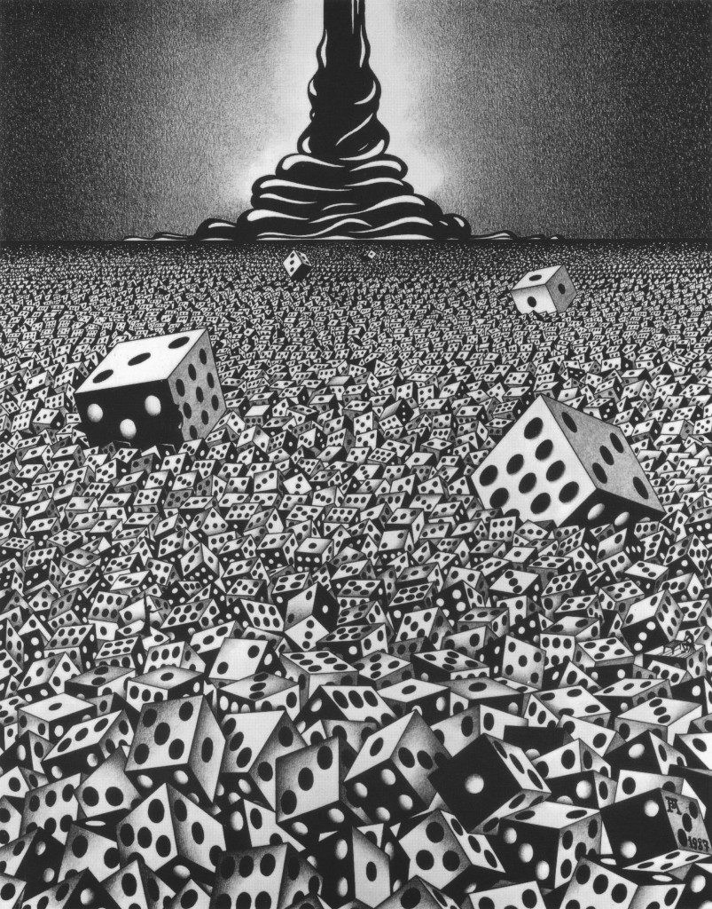

+++
title = "Fomenko"
date = 2020-12-09T00:00:00.000Z
+++

Mon Pilea qui boit gentiment son eau sur le rebord de la table basse. La bataille contre la poussière qui fait rage dans l'appartement. Toujours ces enceintes allumées et le vinyle qui tourne, un journal à moitié lu, plié, qui finira comme paquet cadeau. Le dernier Usbek & Ricka, un demi Socialter et quelques livres éparpillés ici et là. Une guitare triste au coin de la pièce, comme oubliée . Le skate rose posé sagement sur le plancher. Il fait que trop beau aujourd'hui, et bizarement je pense à Anatoly Fomenko, ce célèbre mathématicien russe, devenu fou après s’être aventuré un peu trop loin dans les abysses infinis de la géométrie mathématique. Il nous témoignait de ses expéditions à travers des dessins vertigineux et des peintures titanesques. La vision des coulisses du réel où nous ne sommes pas invités, l’autre côté des murs, le chaos du monde ; un lieu mental où aucune construction est interdite, aucune limite physique ne s'impose. Des dimensions qui défient toute résonance architecturale, là-bas y figurent des temples vertigineux à la gloire du hasard mathématique surplombant l'ombre infime des hommes baignés dans une piscine de dés qui s'étend à perte de vue. On ne dompte pas l'infini, face à ces grands espaces, nous ne sommes plus rien.

Fomenko devenu fou, ravagé par ses visions, publia des théories sordides sur l'Histoire qui fît de l'ombre à son talent indéniable mais méconnu d'artiste.

