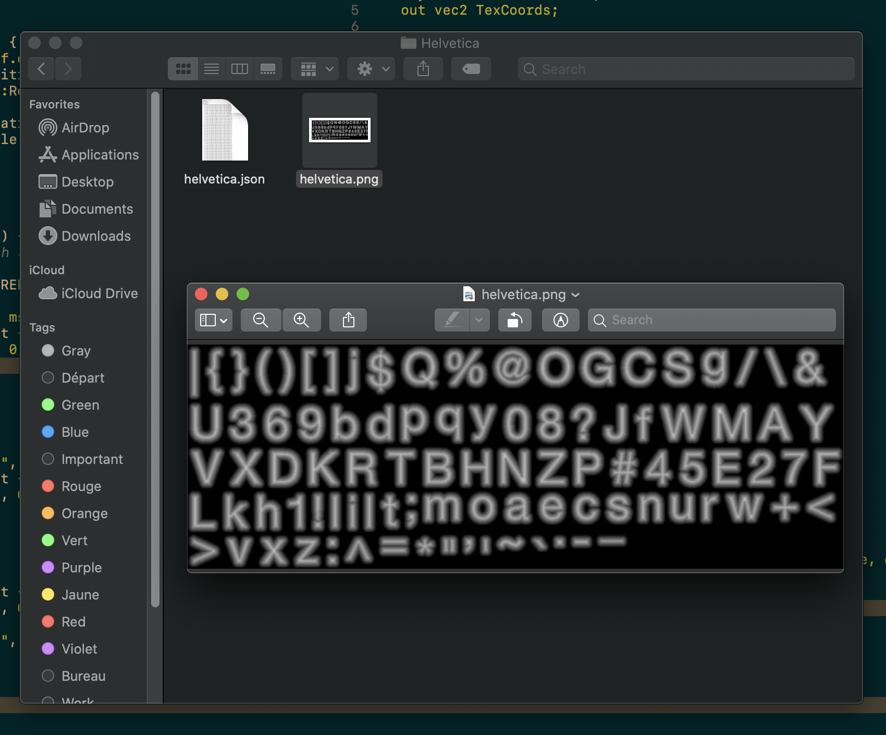
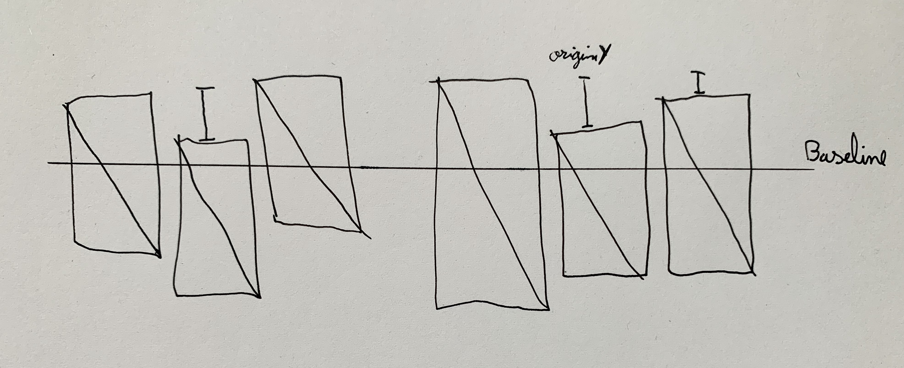
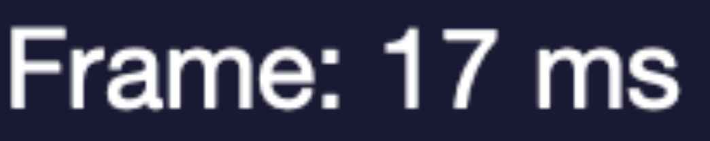
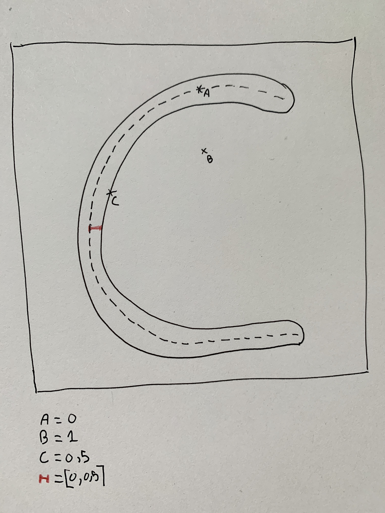
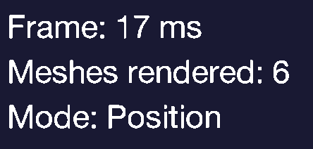
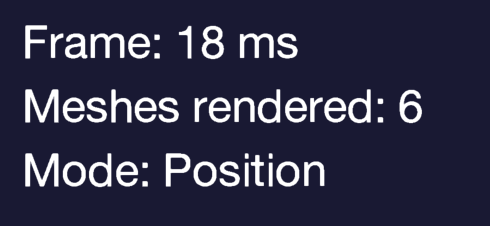

First, a quick introduction about typeface and font and stuff.

A typeface is a set of one or more font. So a font is a collection of readable letters (also called glyph) for a specific size and weight of a related typeface.<br>
A glyph is a shape with embedded properties such as the distance between the further one, the distance from the baseline, etc…

Oh, and a shape on the screen is “just” a bunch of pixels.
<br>
<hr>
<br>
So for my game, I ended up using a bitmap font with a signed distance field encoded in the alpha channel.
<br>
<br>
Tadam, bye, love y'all.<br>
Just kidding.


A bitmap is a matrix of pixels. And a bitmap font is just all the (selected) glyph represented as pixels. In other words, I get one texture with all the glyph inside it. And all the glyph metadata are stored in another file.


I use this metadata file (currently in json) to retrieve each glyph on this texture with all their specific properties. A quick example for the letter “A”:

```
"A": {
    "x":544,
    "y":54,
    "width":40,
    "height":42,
    "originX":6,
    "originY":36,
    "advance":27
}
```

We could easily find the letter on the texture with those properties and construct the letter quad.

> top left: (x, y).<br>
> top right: (x + width).<br>
> bottom left: (x, y + height).<br>
> bottom right: (x + width, y + height).<br>

<em>(careful here, “x” and “y” are not computed in pixels, we have to divide “x” by the texture width to get it, same for “y” with the texture height).</em>

And if we want to draw a letter, we construct a quad and positioning it at the cursor (a variable starting at 0 if it's the first letter), then we place the quad on the baseline using originX and originY. Finally we draw the quad and increment the cursor with the glyph advance, for the next one.

Quick illustration:


And the final code:
```rust
// Position of the glyph on the texture atlas.
let (top_left, top_right, bottom_left, bottom_right) = {
    let top_left = (
        letter.atlas_pos_x / self.atlas_width,
        letter.atlas_pos_y / self.atlas_height,
    );

    let top_right = (
        top_left.0 + (letter.width / self.atlas_width),
        top_left.1,
    );

    let bottom_left = (
        top_left.0,
        top_left.1 + (letter.height / self.atlas_height),
    );

    let bottom_right = (top_right.0, bottom_left.1);

    (top_left, top_right, bottom_left, bottom_right)
};
// 
// 0 is our baseline.
let x_pos = (cursor - letter.origin_x) * scale;
let y_pos = (0. - (letter.height - letter.origin_y)) * scale;
let width = letter.width * scale;
let height = letter.height * scale;

// Quad data for our character with texture position based on 
// character metadata.
#[rustfmt::skip]
let character_quad: [f32; 24] = [
    x_pos, y_pos + height,  top_left.0, top_left.1,
    x_pos,  y_pos,          bottom_left.0, bottom_left.1,
    x_pos + width, y_pos,   bottom_right.0, bottom_right.1,

    x_pos, y_pos + height,  top_left.0, top_left.1,
    x_pos + width, y_pos,   bottom_right.0, bottom_right.1,
    x_pos + width, y_pos + height, top_right.0, top_right.1,
];

// All the text quads are stored in this vertices array.
// We will send this to our GPU to draw all quads.
vertices.extend_from_slice(&character_quad);
cursor += letter.advance;

```

<br>
Everything is awesome but wait. If I change the size of my font without scaling the texture… my text will be blurry right? So each time I want to scale up/down my text… I should use a new texture (and load it to the gpu, etc…)? Really!? Really!?

As an example, a font generated with a size of 32px, then rendered with text scaled to 51px:

<br>
Yup, it's blurry.


To fix that, we are going to use a computed signed distance field. This technique comes from Valve, and was first used for Team Fortress 2. If you want more information about how they used it, it's [here](https://steamcdn-a.akamaihd.net/apps/valve/2007/SIGGRAPH2007_AlphaTestedMagnification.pdf).
<br>

Now, what is a signed distance field? In the context of font rendering, a distance field is a distance from a given pixel to the middle of his related glyph shape. This distance will be stored in the 8-bit alpha channel in a range of `0` to `255` mapped to `[0, 1]`. Where 0 is the maximum negative value, and 1 the maximum positive value, also 0.5 will then represent the exact position of the edge. So any value from 0 to 0.5 should be inside the shape, and 0.5 to 1 outside it.

I drew the letter "C" and picked 3 points.


The points A is inside the shape and exactly in the middle, so the value is 0. Point B is totally outside the shape, so the value is 1; the point C is exactly on the edge so the value is 0.5 and every point near the edge (represented by the red line) are in the range `[0, 1]`.

But, if we render our text with this technique, we get a very aliased text effect. Not really what we wanted.
<br>
<br>

<br>

So in the fragment shader, we could interpolate values near the edge of the shape like `[0.4, 0.6]`. This will produce a smooth text, as follows.
<br>
<br>

<br>
And voilà.<br>
Everything is smooth and tidy and clean and beautiful and...


