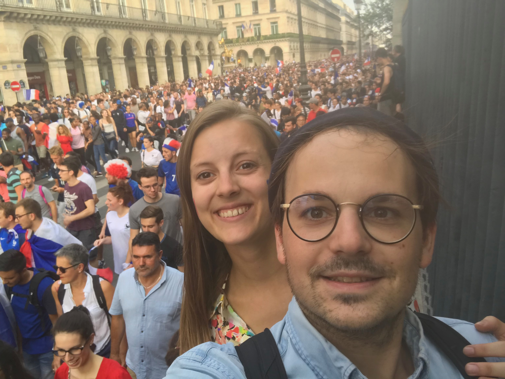
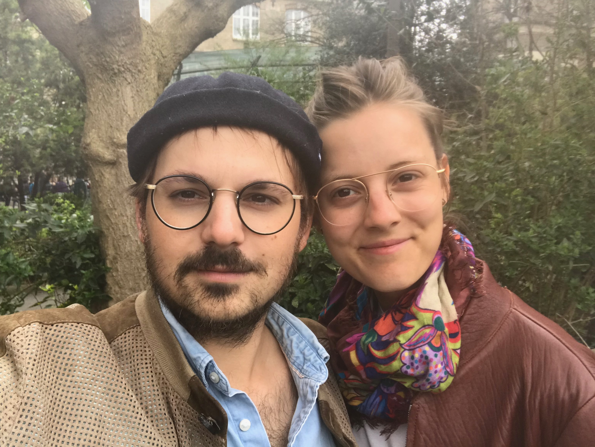
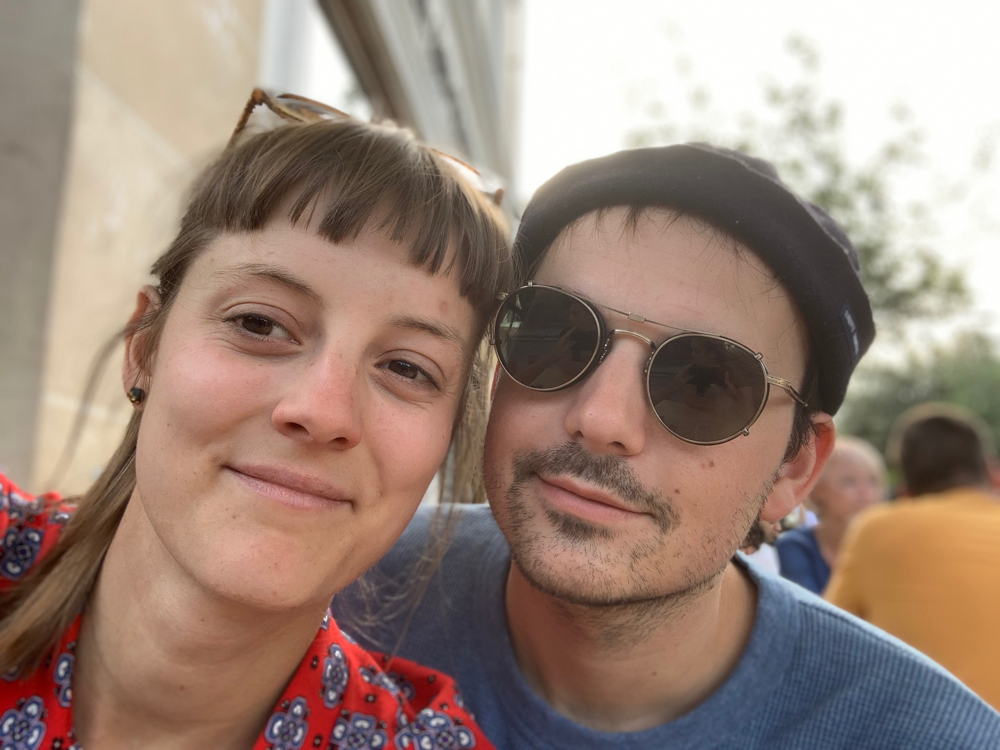
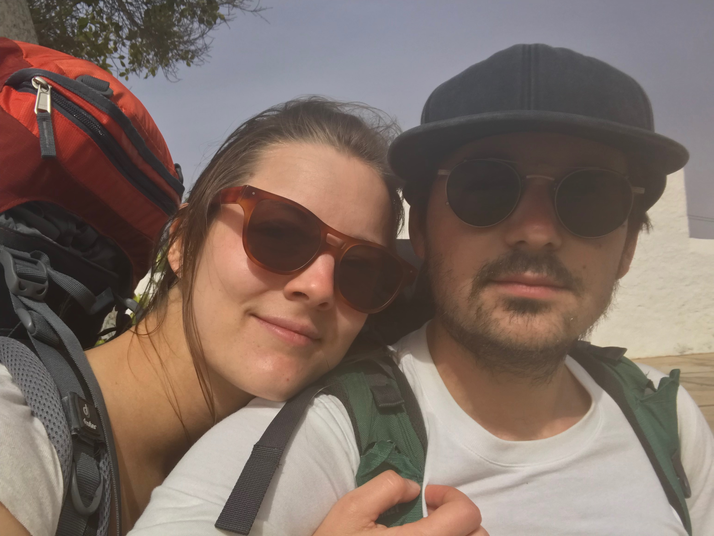

<b>Mar,</b>
 

Je n’arrive plus à t’écrire. 
J’ai un brouillon avec 6000 lignes.
 
 
Je me souviens, de cette année où l’on est parti marcher pendant 10 jours à Fuerteventura. Puis un vol pour trois semaines en Chine, côte à côte assis dans un wagon pour 17h. Et Prague et nos weekends, puis London. 
On s’aimait comme des fous ; c’était seulement l’année dernière, London en septembre dernier. Putain, et tu sautes sur le premier qui arrive à te séduire. Tu es tombé dans son piège, et tu le sais, alors tu fermes les yeux, et tu avances, tel une machine.

Je me souviens de m’être effondré pour la santé de ma mère, quand toi, tu pleurais pour des mensonges. Je n’ai eu aucun soutiens, qu’une bonne gifle quelques jours plus tard.

La seule responsabilité prise, à été la mienne en ajoutant un grain d’honnêteté et de vérité à votre jolie bordel.

Je n’arrive toujours pas à saisir, la portée de tes convictions ainsi que ton <b>égoïsme</b> et ta <b>lâcheté</b> de continuer tes journées avec lui, alors qu’Olivia souffre tous les jours à côté. 
Laisse-moi vomir.

L’époque peut être fier de toi. 
Machine dans la vie professionnelle puis consommateur infidèle dans la vie personnelle. Et ça change son petit titre sur Linkedin. Que l’on t’applaudisse.

Le bonheur ne se trouve pas en _“nous”_ mais bien avec l’autre. Et dans la patience, et les compromis et les petites choses.
Avec les petits gens et leur névroses. 
La vie est longue, jamais vraiment intéressante. Et le sens manquera toujours.

Et épargne moi ton _“j’ai beaucoup appris à tes côtés”_. Je ne suis pas ton mentor. 
Garde cette phrase pour le fatidique jour où tu partiras de l’agence.

<b>Moi</b> j’étais simplement heureux à tes côtés, et oh que ça me suffisait.

 
 

 
 

Le Canada vient d’accepter mon visa. 
À Paris, j'y laisse mon coeur vide et brisé. 
 
 
Je m’envole début septembre.
